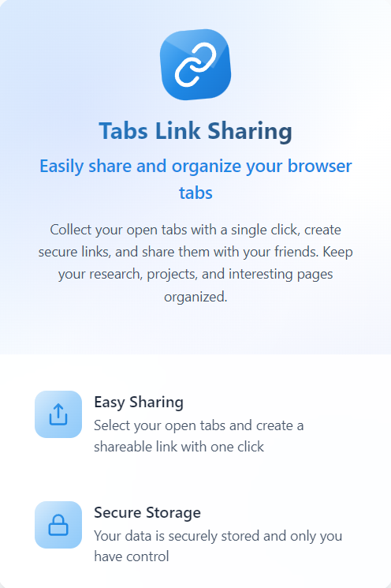
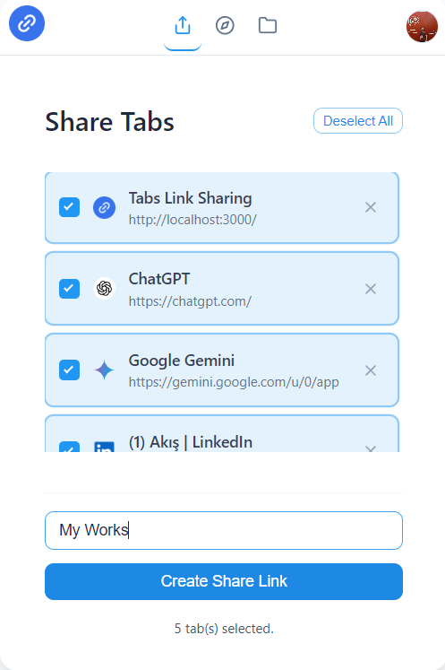

# Tabs Link Sharing - Promotional Website

| Landing Page                                                                                                 | Home Page                                                                                                           |
| :-----------------------------------------------------------------------------------------------------------: | :------------------------------------------------------------------------------------------------------------------: |
| [](public/ss.png) | [](public/ss1.png)  |

This repository contains the source code for the promotional website of **Tabs Link Sharing**, a modern browser extension designed to help you effortlessly convert all your open browser tabs into a single, shareable link.

The website is built with Next.js, TypeScript, and Tailwind CSS, featuring a sleek, responsive design with engaging animations and a clear presentation of the extension's capabilities.

## ✨ Features (Website)

-   **Modern & Responsive Design:** Adapts beautifully to all screen sizes, from mobile to desktop.
-   **Interactive Hero Section:**
    -   **Desktop:** A dynamic, multi-image showcase with hover animations powered by Framer Motion.
    -   **Mobile:** A touch-friendly, swipeable image slider built with SwiperJS.
-   **Clear Information Architecture:** Dedicated sections for showcasing extension features, download links (pointing to the GitHub repository), and project details.
-   **Smooth User Experience:** Smooth scrolling, subtle animations, and a professional look and feel.
-   **Dark Mode Support:** (If applicable - based on your globals.css, it seems you have dark mode theming)
-   **Optimized for Performance:** Leveraging Next.js for fast load times and optimized assets.

## 📥 Installing the Browser Extension

You can install the **Tabs Link Sharing** browser extension by downloading the latest release from our GitHub repository.

1.  **Download the Extension:**
    *   Go to the [Tabs Link Sharing Releases Page](https://github.com/murathanje/Tab-Links/releases/).
    *   Under the latest release (e.g., `v.0.1.0`), download the `project.zip` file (or the relevant ZIP file for the extension).

2.  **Enable Developer Mode in Your Browser:**
    *   **Google Chrome / Microsoft Edge (Chromium):**
        1.  Open your browser and navigate to `chrome://extensions` (for Chrome) or `edge://extensions` (for Edge).
        2.  In the top right corner, toggle on "Developer mode".
    *   **Mozilla Firefox:**
        1.  Open Firefox and navigate to `about:debugging#/runtime/this-firefox`.
        2.  Click "Load Temporary Add-on...".

3.  **Load the Extension:**
    *   **Google Chrome / Microsoft Edge (Chromium):**
        1.  After enabling Developer mode, click on the "Load unpacked" button that appears.
        2.  Navigate to the folder where you extracted the contents of the downloaded ZIP file.
        3.  Select the folder (it should contain a `manifest.json` file and other extension files).
    *   **Mozilla Firefox:**
        1.  After clicking "Load Temporary Add-on...", navigate to the downloaded ZIP file and select it, or navigate to the extracted folder and select the `manifest.json` file.

4.  **Pin the Extension (Recommended):**
    *   Once installed, you should see the Tabs Link Sharing icon in your browser's toolbar (you might need to click the "Extensions" puzzle icon to find and pin it). Pinning it will make it easily accessible.

Now you're ready to use the Tabs Link Sharing extension!

## 🛠️ Technologies Used

-   **Framework:** [Next.js](https://nextjs.org/) (App Router)
-   **Language:** [TypeScript](https://www.typescriptlang.org/)
-   **Styling:** [Tailwind CSS](https://tailwindcss.com/)
-   **UI Components:** [Shadcn/UI](https://ui.shadcn.com/) (Buttons, Cards, Sheet, etc.)
-   **Animations:** [Framer Motion](https://www.framer.com/motion/)
-   **Mobile Slider:** [SwiperJS](https://swiperjs.com/)
-   **Icons:** [Lucide React](https://lucide.dev/)
-   **Font:** [Geist](https://vercel.com/font) (via `next/font`)

## 🚀 Getting Started (Local Development)

Follow these instructions to get a copy of the project up and running on your local machine for development and testing purposes.

### Prerequisites

-   [Node.js](https://nodejs.org/) (v18.x or later recommended)
-   [npm](https://www.npmjs.com/), [yarn](https://yarnpkg.com/), or [pnpm](https://pnpm.io/)

### Installation & Running

1.  **Clone the repository:**
    ```bash
    git clone https://github.com/your-username/your-repo-name.git 
    # Replace with your actual repository URL
    cd your-repo-name
    ```

2.  **Install dependencies:**
    ```bash
    npm install
    # or
    # yarn install
    # or
    # pnpm install
    ```

3.  **Run the development server:**
    ```bash
    npm run dev
    # or
    # yarn dev
    # or
    # pnpm dev
    ```

4.  **Open your browser:**
    Navigate to [http://localhost:3000](http://localhost:3000) to see the website. The page auto-updates as you edit files in the `src` directory.

## 📂 Project Structure (Overview)

-   `src/app/`: Contains the main application pages (e.g., `page.tsx`) and layout (`layout.tsx`).
-   `src/components/`: Houses reusable React components used across the website (e.g., `Header.tsx`, `Footer.tsx`).
-   `src/components/ui/`: Stores UI primitive components, typically managed by Shadcn/UI.
-   `public/`: For static assets like images (e.g., `/icon.png`, `/ss.png`) and other public files.
-   `src/lib/`: Utility functions (e.g., `utils.ts` for `cn`).

## 🤝 Contributing

Contributions, issues, and feature requests are welcome! Feel free to check the [issues page](https://github.com/your-username/your-repo-name/issues) (replace with your actual issues link).

1.  Fork the Project
2.  Create your Feature Branch (`git checkout -b feature/AmazingFeature`)
3.  Commit your Changes (`git commit -m 'Add some AmazingFeature'')
4.  Push to the Branch (`git push origin feature/AmazingFeature`)
5.  Open a Pull Request

## 📄 License

This project is licensed under the MIT License - see the `LICENSE.md` file for details (if you add one). If no `LICENSE.md`